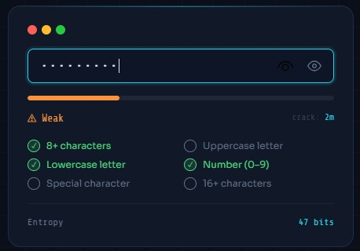
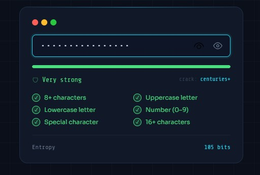

# Password Strength Checker 🔒

## Description
A cybersecurity-focused, real-time **Password Strength Checker** built with pure HTML, CSS, and JavaScript — no frameworks, no dependencies. It evaluates passwords instantly using cryptographic entropy calculations and provides actionable feedback to help users create stronger credentials.

Built after completing the **Introduction to Cybersecurity** certification, applying knowledge of secure credential practices and attack vectors.

---

## Features
- ✅ Real-time password strength evaluation (5 levels: Too Weak → Very Strong)
- ✅ Visual strength bar with animated fill
- ✅ Entropy calculation in bits (cryptographic metric)
- ✅ Estimated crack time (based on offline GPU attack at 1 trillion guesses/sec)
- ✅ 6 live criteria checklist (length, uppercase, lowercase, number, special char, 16+ chars)
- ✅ Show/hide password toggle
- ✅ Fully responsive design
- ✅ Zero external dependencies — single folder, open in browser

---

## Working Principle

### Entropy Calculation
Entropy measures the unpredictability of a password in **bits**:

```
Entropy (bits) = Password Length × log₂(Character Pool Size)
```

| Character Set | Pool Size |
|---|---|
| Lowercase (a–z) | 26 |
| Uppercase (A–Z) | 26 |
| Numbers (0–9) | 10 |
| Special characters | 32 |

Example: `P@ssw0rd123!` uses all four sets (pool = 94), length = 12 → **~78 bits of entropy**

### Crack Time Estimate
Assumes an offline brute-force attack at **1 trillion guesses/second** (modern GPU):

```
Crack Time = 2^entropy / 1,000,000,000,000
```

### Strength Scoring
Scores 0–4 based on how many criteria are satisfied (length thresholds + character variety).

---

## Project Structure

```
Password-Strength-Checker/
├── README.md
├── code/
│   ├── index.html      ← Main HTML structure
│   ├── style.css       ← All styling & animations
│   └── script.js       ← Strength logic & DOM interaction
├── images/
│   ├── setup.jpg
│   └── working.jpg
├── docs/
│   └── explanation.pdf
├── output/
│   └── result_screenshots.png
└── LICENSE
```

---

## How to Run

1. Download or clone this repository
2. Open the `code/` folder
3. Double-click `index.html` — it runs directly in any browser

No server, no install, no build step needed.

---

## Screenshots

| Weak Password | Strong Password |
|---|---|
|  |  |

---

## Code
Available in the [`code/`](code/) folder:
- `index.html` — Page structure and semantic markup
- `style.css` — Visual design, animations, responsive layout
- `script.js` — Strength algorithm, entropy math, DOM updates

---

## Applications
- Personal portfolio project demonstrating cybersecurity concepts
- Embeddable widget for signup/registration forms
- Educational tool for teaching password best practices
- Front-end security awareness training

---

## Technologies Used


---

## Author
**[Aarya Lad]**
- GitHub: [@aarya749l](https://github.com/aarya749l)
- LinkedIn: [Your LinkedIn](https://linkedin.com/in/yourprofile)

---

## License
This project is licensed under the MIT License — see the [LICENSE](LICENSE) file for details.
